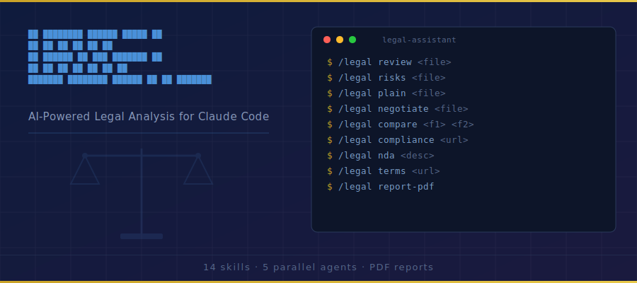

<p align="center">
  
</p>

<p align="center">
  <strong>AI-powered contract review and legal document generation.</strong> Review contracts, flag risks,<br/>
  generate NDAs, check compliance, negotiate terms, and produce client-ready PDF reports — all from Claude Code.
</p>

<p align="center">
  Every contract has hidden risks. This tool finds them in 60 seconds.
</p>

---

## Why This Matters

| Metric | Value |
|--------|-------|
| Average legal review cost | $300–$500/hour |
| Basic contract review | $1,500–$3,000 |
| Freelancers who don't read contracts | 82% |
| Cost of one bad clause | $10,000+ |
| Small businesses without legal review | 67% |
| Time to review with this tool | Under 60 seconds |

---

## ## Quick Start

How to Connect Claude Cowork with a GitHub Repository

Step-by-Step Manual Installation Guide
 
1.  Introduction
This guide explains how to manually connect Claude Cowork with a GitHub repository to install custom AI skills and agents on a Windows computer. It covers everything from prerequisites to running your first legal command — no prior coding experience required.

1.1  What is Cowork?
Claude Cowork is a desktop AI tool that lets you automate file and task management. It runs inside the Claude Desktop app and gives you an AI assistant that can read files, run code, browse the web, and interact with external services like GitHub.

1.2  What is a GitHub Repository?
A GitHub repository (or “repo”) is an online folder where code and files are stored and shared. In this guide, the repository https://github.com/manoj0042/ai-legal-claude contains 14 pre-built AI skills specifically designed for legal work, such as contract review, NDA drafting, and risk analysis.

1.3  What Will Be Installed?
After following this guide, you will have the following installed on your Windows computer:

Component	Details
14 Legal Skills	Contract review, risk analysis, NDA generator, compliance checker, PDF reports, and more
5 AI Agents	Specialised agents for clauses, risks, compliance, terms, and recommendations
Python Scripts	Scripts for generating professional PDF reports
Templates	Pre-built contract review templates
reportlab	Python library required for PDF report generation

 
2.  Prerequisites
Before you begin, make sure the following are installed and set up on your Windows computer.

2.1  Required Software

Software	Purpose	Where to Get It
Claude Desktop App	Cowork mode runs inside this app	claude.ai/download
Claude Code (CLI)	Command-line tool where skills are used	Included with Claude Desktop
Python 3	Required for PDF report generation	python.org/downloads
GitHub MCP Connector	Lets Cowork read GitHub repos	Added via Cowork Plugin settings

⚠️	Tip: When installing Python on Windows, tick the box that says “Add Python to PATH” before clicking Install. This is essential for pip commands to work.

 
3.  Overview of the Process
The installation involves 7 main steps. Each step is explained in detail in Section 4.

STEP 1	Enable the GitHub MCP Connector in Cowork
This gives Cowork the ability to read files from any GitHub repository.

STEP 2	Share the GitHub Repository URL with Claude
Tell Claude which repo contains the skills you want to install.

STEP 3	Claude Reads and Understands the Repo
Claude uses the GitHub connector to browse the repo structure and read the installer script.

STEP 4	Claude Downloads and Packages the Files
Claude clones the repo in its sandbox and copies all skills, agents, and scripts into your Cowork outputs folder.

STEP 5	Claude Creates a Windows Installer
Claude generates an INSTALL-WINDOWS.bat file tailored for your Windows machine.

STEP 6	You Run the Installer
You navigate to the outputs folder in File Explorer and double-click the batch file.

STEP 7	Test the Skills in Claude Code
Open Claude Code and run your first /legal command to confirm everything works.

 
4.  Detailed Step-by-Step Instructions
Step 1  —  Enable the GitHub MCP Connector
The GitHub MCP (Model Context Protocol) connector is what allows Cowork to read files from GitHub without you needing to log in or download anything manually.

How to enable it:
1.	Open the Claude Desktop app on your Windows computer.
2.	Click on your profile icon or Settings in the top-left or bottom-left corner.
3.	Navigate to Plugins or Connectors in the settings menu.
4.	Search for “GitHub” in the available connectors list.
5.	Click Install or Enable next to the GitHub connector.
6.	Authenticate with your GitHub account if prompted (this is a one-time step).
7.	Return to the Cowork chat interface — the connector is now active.

💡	Once the GitHub connector is enabled, Claude can read any public GitHub repository directly. For private repos, you will need to authenticate with a GitHub Personal Access Token.

Step 2  —  Share the GitHub Repository URL with Claude
Open a new Cowork conversation and give Claude the GitHub URL of the repository that contains the skills you want to install.

Example message to type in Cowork:
Connect my Claude Code to GitHub repo https://github.com/manoj0042/ai-legal-claude/tree/main to use the plugins and skills here

Claude will then use the GitHub connector to browse the repository and identify what needs to be installed.

Step 3  —  Claude Reads the Repository
Once given the URL, Claude automatically:
•	Connects to GitHub using the MCP connector
•	Browses the top-level folder structure of the repository
•	Reads key files such as install.sh and README.md to understand what the repo contains
•	Identifies the skills/, agents/, scripts/, and templates/ folders
•	Reads the install script to understand the installation logic

You do not need to do anything during this step. Claude handles it entirely on its own.

Step 4  —  Claude Downloads and Packages the Files
Claude uses its built-in Linux sandbox to clone the repository and package everything for your machine.

What Claude does internally:
8.	Runs   git clone https://github.com/manoj0042/ai-legal-claude.git   in its Linux sandbox
9.	Copies all 14 skill SKILL.md files into an ai-legal-install/skills/ folder
10.	Copies all 5 agent .md files into an ai-legal-install/agents/ folder
11.	Copies Python scripts and templates into the appropriate sub-folders
12.	Installs reportlab in its own sandbox environment to verify it works
13.	Saves the entire ai-legal-install folder to your Cowork outputs folder

🔗	The Cowork outputs folder is a special shared bridge between Claude’s Linux sandbox and your Windows computer. Any file Claude saves there appears directly on your PC.

Step 5  —  Claude Creates a Windows Installer
Because the GitHub repo’s original install.sh is a bash script (for Mac/Linux), Claude detects that your machine is Windows and automatically creates a Windows-compatible batch file instead.

The INSTALL-WINDOWS.bat file that Claude creates:
•	Uses %USERPROFILE%\.claude\ as the installation destination (your Windows Claude folder)
•	Creates the necessary skills\ and agents\ sub-folders automatically
•	Copies all 14 skills and 5 agents using Windows xcopy commands
•	Runs pip install reportlab to install the PDF library
•	Displays a green tick (OK) for each item successfully installed
•	Shows a summary of what was installed and where

 
Step 6  —  Run the Installer
This is the only step where you need to take action on your Windows computer.

6.1  Find the Outputs Folder
The outputs folder is located deep inside your AppData folder. Paste the path below into the File Explorer address bar and press Enter:

C:\Users\YourUsername\AppData\Roaming\Claude\local-agent-mode-sessions\

Replace YourUsername with your actual Windows username (e.g. Manoj42Law). Inside that folder, navigate through the session sub-folders until you find the outputs\ai-legal-install\ folder.

💡	If you are unsure of the exact session folder path, ask Claude in Cowork: “What is the full Windows path to my outputs folder?”  Claude will give you the exact path to copy.

6.2  Run the Batch File
14.	Open File Explorer and navigate to the ai-legal-install folder.
15.	You will see two files and two folders: agents\, skills\, install.sh, and INSTALL-WINDOWS.bat
16.	Right-click on INSTALL-WINDOWS.bat
17.	Select Run as administrator from the context menu.
18.	A black Command Prompt window will appear and begin installing.
19.	Watch as each item is confirmed with an OK message.
20.	When complete, press any key to close the window.

⚠️	Running as administrator ensures the batch file has permission to create folders inside your user profile. If you see a “Windows protected your PC” warning, click More info and then Run anyway — this is expected for unsigned batch files.

Step 7  —  Test the Skills in Claude Code
Now that everything is installed, it’s time to test the skills.

7.1  Open Claude Code
21.	Press Windows key + S and type Claude Code.
22.	Click the Claude Code application to open it.
23.	Alternatively, open Command Prompt or PowerShell and type: claude

7.2  Run Your First Legal Skill
Navigate to the folder where your contract file is located, then type one of the commands below:

Command	What It Does
/legal review <file>	Full 5-agent contract review with detailed analysis
/legal risks <file>	Identifies risky or one-sided clauses in a contract
/legal plain <file>	Translates legal language into plain English
/legal compare <f1> <f2>	Side-by-side comparison of two contract versions
/legal negotiate <file>	Generates counter-proposals for unfavourable terms
/legal missing <file>	Finds missing protections in a contract
/legal nda <description>	Generates a custom Non-Disclosure Agreement
/legal agreement <type>	Creates a business agreement from scratch
/legal terms <url>	Generates Terms of Service for a website
/legal privacy <url>	Generates a Privacy Policy for a website
/legal compliance <url>	Identifies compliance gaps in documents or websites
/legal freelancer <file>	Freelancer-specific contract review and advice
/legal report-pdf	Exports the last analysis as a professional PDF

7.3  Example Usage
To review a contract PDF stored in your Documents folder:
cd Documents
/legal review MyContract.pdf

Claude will run 5 specialist agents across your contract and produce a comprehensive analysis covering clauses, risks, missing protections, compliance gaps, and recommended changes.

 
5.  How It Works Under the Hood
Understanding the technology behind this process helps you troubleshoot issues and adapt the method for other GitHub repositories.

5.1  The Four Key Components

Component	Role
GitHub MCP Connector	Allows Claude to read any GitHub repository directly via API, without you needing to download or clone anything manually.
Claude’s Linux Sandbox	A temporary Linux computer Claude has access to. It runs git clone, pip install, and file copy commands to prepare your installation package.
Cowork Outputs Folder	A special shared folder that acts as a bridge between Claude’s Linux sandbox and your Windows PC. Files saved here by Claude appear instantly on your computer.
Windows Batch File	A .bat script that Claude generates specifically for Windows. It uses standard Windows commands (mkdir, xcopy, pip) to install files into the correct Claude Code directories.

5.2  Where Files Are Installed
The batch file installs everything into your Windows user profile’s .claude folder:

Windows Path	Contents
C:\Users\YourName\.claude\skills\	All 14 legal skill SKILL.md files
C:\Users\YourName\.claude\skills\legal\scripts\	Python scripts for PDF generation
C:\Users\YourName\.claude\skills\legal\templates\	Contract review templates
C:\Users\YourName\.claude\agents\	5 specialist AI agent files

6.  Troubleshooting

6.1  Common Issues and Fixes

Problem	Likely Cause	Solution
Batch file says 'Access Denied'	Not running as administrator	Right-click the .bat file and choose Run as administrator
'pip' is not recognized	Python not added to PATH	Reinstall Python and tick 'Add to PATH'
Skills not showing in Claude Code	Claude Code not restarted after install	Close and reopen Claude Code completely
GitHub connector not available	Plugin not installed in Cowork	Go to Settings > Plugins and install GitHub connector
PDF report fails to generate	reportlab not installed	Open PowerShell and run: pip install reportlab

6.2  Verify Your Installation
To check that all skills are installed correctly, open PowerShell and run:
dir %USERPROFILE%\.claude\skills

You should see folders for each of the 14 skills. To verify reportlab:
python -c "import reportlab; print(reportlab.Version)"

A version number (e.g. 4.4.10) confirms reportlab is working correctly.

 
7.  Applying This Method to Other Repositories
The same process works for any GitHub repository that contains Claude Code skills or agents. Simply change the GitHub URL in Step 2 and follow the same steps.

For best results, the repository should contain:
•	A skills/ folder with SKILL.md files for each skill
•	An agents/ folder with agent .md files
•	An install script (install.sh for Linux/Mac or a .bat file for Windows)
•	A README.md explaining what each skill does

💡	Claude is smart enough to adapt. Even if the repo doesn’t have a Windows batch file, Claude will read the bash install script and create an equivalent Windows version automatically.

8.  Summary
You have now successfully:
•	Connected Claude Cowork to a GitHub repository using the GitHub MCP connector
•	Used Claude’s Linux sandbox to clone and package the repository files
•	Transferred files to your Windows machine via the Cowork outputs folder
•	Installed 14 legal AI skills and 5 specialist agents into Claude Code
•	Installed the reportlab Python library for PDF report generation
•	Verified the installation and tested your first legal skill

The entire process — from a GitHub URL to working AI skills on your PC — requires only one manual action from you: double-clicking the batch file. Everything else is handled by Claude automatically.


That's it. One command installs all 14 skills, 5 agents, and the PDF generation scripts.

---

## All 14 Commands

### Contract Analysis
| Command | What It Does |
|---------|-------------|
| `/legal review <file>` | **Flagship** — Full contract review with 5 parallel agents. Returns a Contract Safety Score, clause-by-clause analysis, and prioritized recommendations. |
| `/legal risks <file>` | Deep risk analysis with severity scoring for every clause. Estimates financial exposure. |
| `/legal compare <file1> <file2>` | Side-by-side comparison of two contract versions. Flags additions, removals, and dangerous changes. |
| `/legal plain <file>` | Translates every clause from legalese into plain English anyone can understand. |
| `/legal negotiate <file>` | Generates specific counter-proposals with replacement language for every unfavorable clause. |
| `/legal missing <file>` | Finds protections that SHOULD be in the contract but aren't. |

### Document Generation
| Command | What It Does |
|---------|-------------|
| `/legal nda <description>` | Generates a custom NDA — mutual, one-way, employee, or vendor. |
| `/legal terms <url>` | Generates terms of service based on what the website actually does. GDPR/CCPA compliant. |
| `/legal privacy <url>` | Generates a privacy policy by scanning what data the site collects. |
| `/legal agreement <type>` | Generates business agreements — freelancer contracts, partnerships, SOWs, MSAs, and more. |
| `/legal freelancer <file>` | Specialized review from the freelancer's perspective. Flags common contractor traps. |

### Compliance & Reporting
| Command | What It Does |
|---------|-------------|
| `/legal compliance <url>` | Compliance gap analysis — GDPR, CCPA, ADA, PCI-DSS, CAN-SPAM, SOC 2. |
| `/legal report-pdf` | Professional PDF report with score gauges, risk charts, and prioritized actions. |

---

## The Flagship: `/legal review`

The most powerful command. Run it on any contract and get:

1. **Contract Safety Score** (0-100) with letter grade
2. **Risk Dashboard** — high/medium/low risk clause counts
3. **Clause-by-Clause Analysis** — every clause scored, explained in plain English, with specific fix recommendations
4. **Missing Protections** — what should be there but isn't
5. **Obligations Timeline** — every deadline and consequence mapped
6. **Compliance Flags** — regulatory issues flagged
7. **Negotiation Priorities** — ranked list of what to change first
8. **Next Steps** — actionable checklist

### How It Works

```
/legal review my-contract.pdf
```

5 AI agents launch in parallel:

| Agent | Role | Weight |
|-------|------|--------|
| Clause Analyst | Identifies and categorizes every clause | 20% |
| Risk Assessor | Scores each clause for risk | 25% |
| Compliance Checker | Flags regulatory issues | 20% |
| Terms Mapper | Maps obligations, deadlines, and triggers | 15% |
| Recommendations Engine | Generates specific fixes | 20% |

Results are aggregated into a unified report with a single Contract Safety Score.

---

## Use Cases

### For Freelancers & Agencies
- Review client contracts before signing
- Generate NDAs for new client engagements
- Create statements of work with proper protections
- Offer contract review as a paid service ($500-$1,500 per review)

### For Small Businesses
- Review vendor and supplier contracts
- Generate privacy policies and terms of service
- Run compliance audits on your website
- Understand what you're actually agreeing to

### For AI Automation Agencies
- Add contract review to your service offering
- Generate professional PDF reports for clients
- Offer monthly legal document management retainers
- Pair with the AI Marketing Suite and AI Sales Team

---

## Project Structure

```
ai-legal-claude/
├── legal/
│   └── SKILL.md                    # Main orchestrator (command router)
├── skills/
│   ├── legal-review/SKILL.md       # Full contract review (5 agents)
│   ├── legal-risks/SKILL.md        # Deep risk analysis
│   ├── legal-compare/SKILL.md      # Contract comparison
│   ├── legal-plain/SKILL.md        # Plain English translation
│   ├── legal-negotiate/SKILL.md    # Counter-proposal generator
│   ├── legal-missing/SKILL.md      # Missing protections finder
│   ├── legal-nda/SKILL.md          # NDA generator
│   ├── legal-terms/SKILL.md        # Terms of service generator
│   ├── legal-privacy/SKILL.md      # Privacy policy generator
│   ├── legal-agreement/SKILL.md    # Business agreement generator
│   ├── legal-compliance/SKILL.md   # Compliance gap analysis
│   ├── legal-freelancer/SKILL.md   # Freelancer contract review
│   └── legal-report-pdf/SKILL.md   # PDF report generator
├── agents/
│   ├── legal-clauses.md            # Clause analysis agent
│   ├── legal-risks.md              # Risk assessment agent
│   ├── legal-compliance.md         # Compliance check agent
│   ├── legal-terms.md              # Terms & obligations agent
│   └── legal-recommendations.md    # Recommendations agent
├── scripts/
│   └── generate_legal_pdf.py       # PDF generation (ReportLab)
├── templates/
│   └── contract-review-template.md # Report template
├── install.sh                      # One-line installer
├── uninstall.sh                    # Clean uninstaller
└── README.md
```

---

## Requirements

- **Claude Code** (with an active Anthropic API key)
- **Python 3.8+** (for PDF generation only)
- **reportlab** — `pip3 install reportlab` (for PDF generation only)

---


